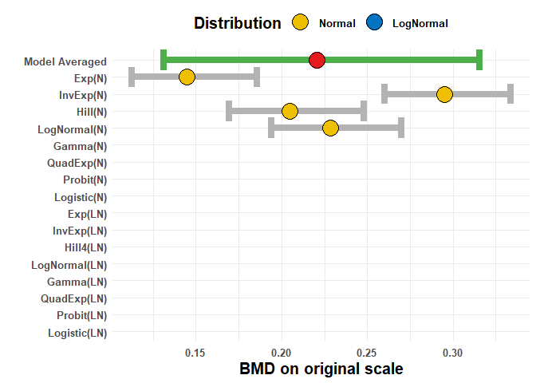
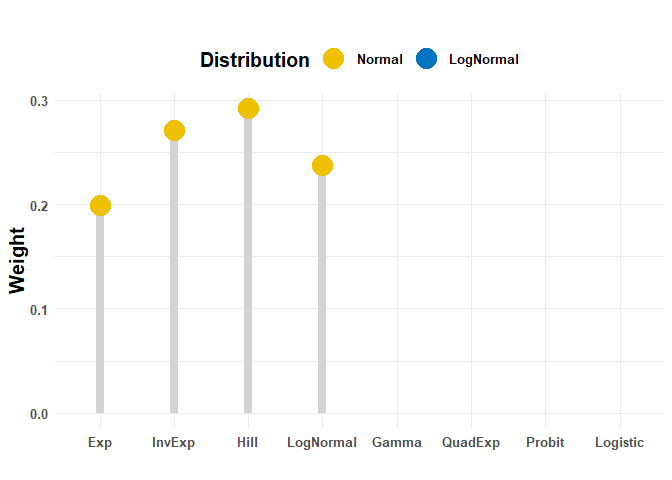
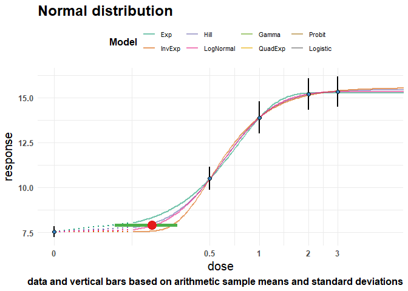
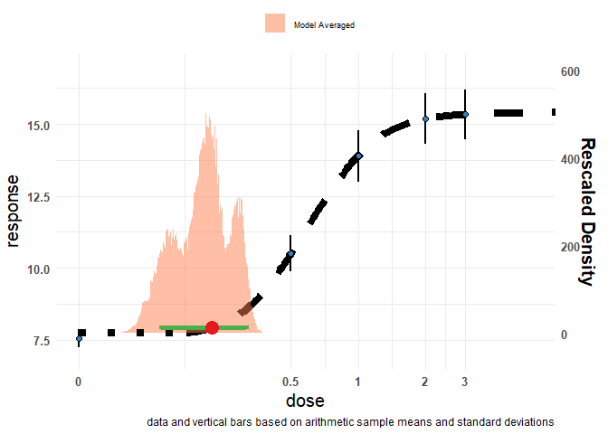

<!-- README.md is generated from README.Rmd. Please edit that file -->

# BMABMDR

<!-- badges: start -->
<!-- badges: end -->

BMABMDR is an R package for Bayesian model averaging in benchmark dose
estimation. Its two main functions are:

-   `full.laplace_MA()` to perform model averaging using Laplace
    approximation

-   `sampling_MA()` to perform model averaging using Bridge sampling

## Installation

You can install the development version of BMABMDR from
[GitHub](https://github.com/) with:

``` r
# install.packages("devtools")
devtools::install_github("cecilekremer/BMABMDR")
```

## Example

This is a basic example which shows you how to use the package:

``` r
library(BMABMDR)

## Set summary data

summ.data <- data.frame(x = c(0,0.5,1,2,3),
                        y = c(7.534954, 10.500018, 13.886423, 15.192057, 15.331456),
                        s = c(0.3131743, 0.6299896, 0.8874875, 0.8709575, 0.8501652),
                        n = c(20, 20, 20, 20, 20))

## Check if there is a dose-response effect

anydoseresponseN(summ.data$x, summ.data$y, summ.data$s, summ.data$n)
#> $bf
#> Estimated Bayes factor in favor of bridge_H0 over bridge_SM: 0.00000
#> 
#> $bf.message
#> [1] "there is sufficient evidence that there is a substantial dose-effect"
anydoseresponseLN(summ.data$x, summ.data$y, summ.data$s, summ.data$n)
#> $bf
#> Estimated Bayes factor in favor of bridge_H0 over bridge_SM: 0.00000
#> 
#> $bf.message
#> [1] "there is sufficient evidence that there is a substantial dose-effect"

## Prepare data to pass to main functions

data_N <- PREP_DATA_N(data = summ.data,
                       sumstats = TRUE, sd = TRUE, q = 0.05)
#> GAMLSS-RS iteration 1: Global Deviance = -8.2198 
#> GAMLSS-RS iteration 2: Global Deviance = -8.2198
#> Default prior choices used on background
#> Default prior choices used on fold change
#> Default prior choices used on BMD
#> GAMLSS-RS iteration 1: Global Deviance = 4.4297 
#> GAMLSS-RS iteration 2: Global Deviance = 4.4297 
#> new prediction 
#> new prediction 
#> new prediction 
#> new prediction 
#> new prediction 
#> new prediction
data_LN <- PREP_DATA_LN(data = summ.data,
                       sumstats = TRUE, sd = TRUE, q = 0.05)
#> Distributional assumption of constant variance (on log-scale) are met, Bartlett test p-value is 0.4557
#> GAMLSS-RS iteration 1: Global Deviance = -8.2198 
#> GAMLSS-RS iteration 2: Global Deviance = -8.2198
#> Default prior choices used on background
#> Default prior choices used on fold change
#> Default prior choices used on BMD
#> GAMLSS-RS iteration 1: Global Deviance = 4.4297 
#> GAMLSS-RS iteration 2: Global Deviance = 4.4297 
#> new prediction 
#> new prediction 
#> new prediction 
#> new prediction 
#> new prediction 
#> new prediction

## Perform model averaging using Laplace approximation

# We include only Family 1 for the Normal distribution in this example
FLBMD <- full.laplace_MA(data_N, data_LN, prior.weights = c(rep(1, 4), rep(0, 12)))
#>      BMDL       BMD      BMDU 
#> 0.1310523 0.2205689 0.3156180 
#> [1] "Best fitting model fits sufficiently well (Bayes factor is 9.84e+00)."

# Plot results
pFLBMD <- plot.BMADR(FLBMD, type = 'increasing', weight_type = 'LP', title = '')
pFLBMD$BMDs
```



``` r
pFLBMD$weights
```



``` r
pFLBMD$model_fit_N
```



``` r
pFLBMD$MA_fit
```



``` r
## Perform model averaging using Bridge sampling

SBMD <- sampling_MA(data_N, data_LN, prior.weights = c(rep(1, 4), rep(0, 12)))
#> convergence achieved.
#> convergence achieved.
#> 
#> convergence achieved.
#> 
#> convergence achieved.
#> [1] "Best fitting model fits sufficiently well (Bayes factor is 9.09e+00)."

# Plot results
pSBMD <- plot.BMADR(SBMD, type = 'increasing', weight_type = 'BS', title = '')
```

## Getting help

If you encounter a bug, please file an issue with a minimal reproducible
example on [GitHub](https://github.com/cecilekremer/BMABMDR/issues).
